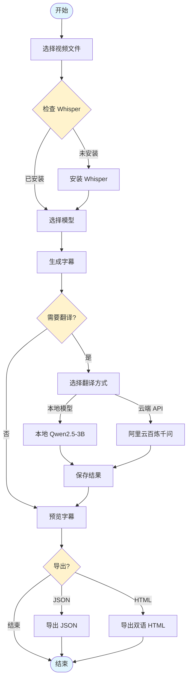

# VideoSubtitle - 视频字幕生成与翻译工具

一款基于 [Wails](https://wails.io/) (Go + React + TypeScript) 开发的桌面应用，用于自动生成视频字幕并翻译成中文。

[English Version](README.md)

## 功能特性

- **自动生成字幕**：使用 OpenAI Whisper 将视频语音转录为字幕
- **AI 智能翻译**：支持本地模型 (Qwen2.5-3B) 或阿里云百炼千问 API 翻译字幕
- **实时预览**：播放视频时同步显示双语字幕
- **进度追踪**：可视化的进度条显示生成和翻译任务进度
- **一键安装**：一键设置 Whisper 环境
- **多模型支持**：支持多种 Whisper 模型 (tiny, base, small, medium, large)
- **多语言支持**：自动检测语言或手动指定
- **双语导出**：导出双语对照的 HTML 页面

## 工作流程

### 字幕生成与翻译流程



### 详细流程说明

1. **选择视频**：通过文件选择器选择视频文件
2. **Whisper 环境检查**：检查是否已安装 Whisper，如未安装提供一键安装
3. **选择模型**：根据速度和精度需求选择不同的 Whisper 模型
4. **生成字幕**：Whisper 将音频转录为带时间戳的字幕
5. **翻译字幕（可选）**：
   - **本地模式**：使用本地运行的 Qwen2.5-3B 模型（注重隐私，离线可用）
   - **云端模式**：使用阿里云百炼千问 API（速度更快，需要 API Key）
6. **预览**：实时双语字幕预览，与视频播放同步
7. **导出**：导出字幕为 JSON 格式或生成双语对照的 HTML 页面

## 下载

[v1.0.0](https://github.com/eraft-io/VedioAI/releases/tag/v1.0.0)

## 技术栈

- **后端**：Go + Wails v2
- **前端**：React + TypeScript + Vite
- **AI/ML**：
  - OpenAI Whisper 语音转文字
  - llama.cpp + Qwen2.5-3B 本地翻译
  - 阿里云百炼千问 API 云端翻译
- **环境管理**：Conda 管理 Python 依赖

## 环境要求

- [Go](https://golang.org/dl/) 1.18+
- [Node.js](https://nodejs.org/) 16+
- [Wails CLI](https://wails.io/docs/gettingstarted/installation)
- [Anaconda](https://www.anaconda.com/) 或 [Miniconda](https://docs.conda.io/en/latest/miniconda.html)

## 开发运行

```bash
# 安装依赖
wails dev

# 构建应用
wails build
```

## 使用说明

### 快速开始

1. 打开应用，点击"选择视频"按钮选择要处理的视频文件
2. 选择 Whisper 模型（推荐 base 模型，平衡速度和精度）
3. 点击"生成字幕"按钮开始转录
4. （可选）点击"翻译字幕"按钮，选择翻译方式：
   - **本地模型**：首次使用需要下载约 2GB 的模型文件
   - **阿里云千问**：需要配置阿里云 API Key
5. 预览生成的双语字幕
6. 导出字幕为 JSON 或 HTML 格式

### 阿里云百炼千问 API 配置

1. 访问 [阿里云百炼控制台](https://dashscope.console.aliyun.com/)
2. 登录/注册阿里云账号
3. 进入 API-KEY 管理页面创建新的 API Key
4. 在应用中选择"云端翻译"方式，粘贴 API Key 即可

## 许可证

MIT License
