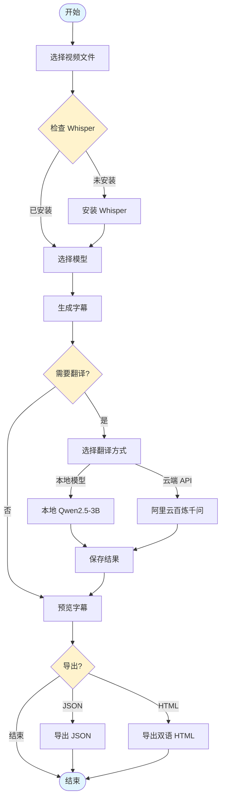
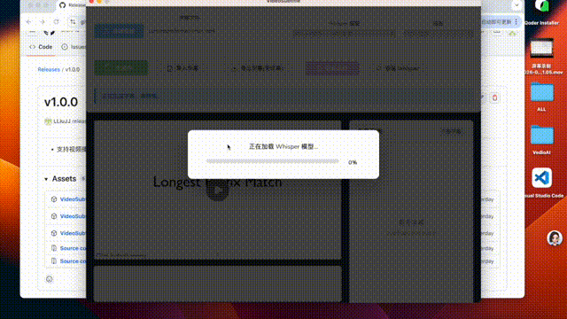

# VideoSubtitle

A desktop application for automatic video subtitle generation and translation, built with [Wails](https://wails.io/) (Go + React + TypeScript).

[中文版本](README.md)

## Features

- **Automatic Subtitle Generation**: Uses OpenAI Whisper to transcribe video audio into subtitles
- **AI Translation**: Translates subtitles to Chinese using local LLM (Qwen2.5-3B via llama.cpp) or Alibaba Cloud Qwen API
- **Real-time Preview**: Watch videos with synchronized bilingual subtitles
- **Progress Tracking**: Visual progress bars for generation and translation tasks
- **Auto-installation**: One-click setup for Whisper environment
- **Multiple Models**: Supports various Whisper models (tiny, base, small, medium, large)
- **Multi-language Support**: Auto-detects language or specify manually
- **Bilingual Export**: Export subtitles as bilingual HTML page

## Workflow

### Subtitle Generation & Translation Flow

### Detailed Process

1. **Video Selection**: User selects a video file through the file picker
2. **Whisper Setup**: The app checks if Whisper is installed, offers one-click installation if needed
3. **Model Selection**: Choose from different Whisper models based on speed/accuracy needs
4. **Subtitle Generation**: Whisper transcribes the audio to generate subtitles with timestamps
5. **Translation (Optional)**:
   - **Local Mode**: Uses Qwen2.5-3B model running locally (privacy-focused, offline)
   - **Cloud Mode**: Uses Alibaba Cloud Bailian Qwen API (faster, requires API key)
6. **Preview**: Real-time bilingual subtitle preview synchronized with video playback
7. **Export**: Export subtitles as JSON or generate a bilingual HTML page

## Demo

## Download

[v1.0.0](https://github.com/eraft-io/VedioAI/releases/tag/v1.0.0)

## Tech Stack

- **Backend**: Go with Wails v2
- **Frontend**: React + TypeScript + Vite
- **AI/ML**: 
  - OpenAI Whisper for speech-to-text
  - llama.cpp with Qwen2.5-3B for translation
- **Environment**: Conda for Python dependency management

## Prerequisites

- [Go](https://golang.org/dl/) 1.18+
- [Node.js](https://nodejs.org/) 16+
- [Wails CLI](https://wails.io/docs/gettingstarted/installation)
- [Anaconda](https://www.anaconda.com/) or [Miniconda](https://docs.conda.io/en/latest/miniconda.html)
